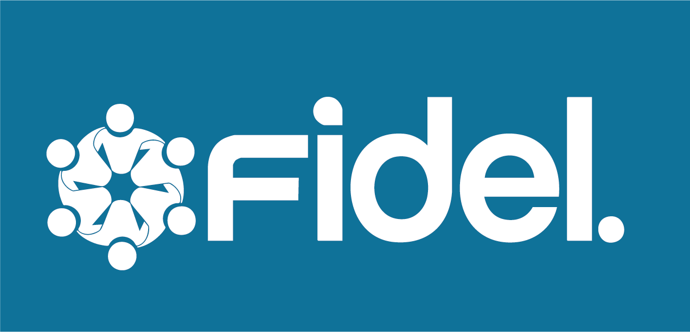

# Fidel Assistant

Plateforme mobile **gratuite et open source** d’accompagnement des patients dans la prise de leurs médicaments et le suivi de leur santé — en particulier pour les traitements chroniques (tuberculose, diabète, hypertension, VIH, etc.), avec un focus sur le contexte camerounais et africain (connectivité faible, téléphones basiques, réseau familial fort).

> **Ce n’est jamais un outil de diagnostic ni un substitut au médecin.**  
> C’est un **compagnon d’accompagnement**.

## État du projet (V1)

| Étape | Statut |
|---|---|
| Auth API (email OTP, Google IdP, sessions, Resend) | **Fait** — sur `main`, tests verts |
| Onboarding capacités (infos → suivi? → home ; sync aidant) | **Fait** — sur `main` (step C léger) |
| Dashboard + médicaments / horaires / prises (API) | **Fait** — sur `main` |
| App Flutter auth + onboarding + alarmes locales patient | **Fait** (socle) |
| Rappels offline-first + sync V2 | **Fait** (Phase 6 + polish A–D) |
| Constantes / SOS / FCM aidant / cron manquée | **Fait** (API + jobs + UI Santé) |
| UI patient (phases 1→5) | **Fait** — activation, checklist, traitements, profil, sync visible |
| UI aidant (phases A→D) | **Fait** — Accueil, détail/alertes, Cercle, timeline + mute |

Détail des phases : [`.cursor/architecture.md`](.cursor/architecture.md). Pour contribuer : [CONTRIBUTING.md](CONTRIBUTING.md). Specs : [`docs/`](docs/) et [`skills/`](skills/).

## Règle produit absolue

```
OBSERVER → ENCOURAGER / INFORMER → PROPOSER → ATTENDRE LE CONSENTEMENT EXPLICITE
```

Le système ne contacte jamais un tiers (aidant, médecin, urgence) automatiquement, sauf si le patient a explicitement pré-autorisé cette règle.

## Stack

| Couche | Techno |
|---|---|
| Backend | Python + FastAPI (`/api/v1`) — prod : `https://educampro.edu.cm` |
| Base de données | Neon (Postgres serverless) + Alembic |
| Mobile | Flutter (Android / iOS), offline-first |
| Auth | JWT + OTP maison + Google OAuth (IdP) |
| Emails | Resend (`@educampro.edu.cm`) |

## Structure du dépôt

```
.
├── backend/          # API FastAPI
├── mobile/           # Application Flutter
├── skills/           # Specs & contrats (lire avant de coder)
├── docs/             # Guides humains (auth Google, Resend, tests…)
├── .cursor/          # Architecture Cursor (@architecture)
└── .github/          # CI, templates issues & PR
```

## Prérequis

- Python **3.12+**
- Flutter **3.22+** (stable)
- Compte [Neon](https://neon.tech) (Postgres) pour le backend
- Compte [Resend](https://resend.com) pour envoyer les OTP (optionnel en local : OTP loggé si pas de clé)
- Git

## Démarrage rapide

### Backend

```bash
cd backend
python -m venv .venv

# Windows
.venv\Scripts\activate

# macOS / Linux
source .venv/bin/activate

pip install -e ".[dev]"
cp .env.example .env
# Éditer .env : DATABASE_URL, JWT_SECRET, RESEND_API_KEY (optionnel), Google Client IDs

alembic upgrade head
uvicorn app.main:app --reload --host 127.0.0.1 --port 8000
```

- API docs : http://127.0.0.1:8000/docs  
- Tests : `pytest -q` (voir [docs/auth-test-battery.md](docs/auth-test-battery.md))

### Mobile

```bash
cd mobile
flutter run
```

L’URL API (téléphone physique) et Google Sign-In sont dans `mobile/assets/config/app.json`.

## Documentation

| Document | Contenu |
|---|---|
| [CONTRIBUTING.md](CONTRIBUTING.md) | Comment contribuer |
| [docs/README.md](docs/README.md) | Index des guides |
| [skills/README.md](skills/README.md) | Index des specs / contrats |
| [CODE_OF_CONDUCT.md](CODE_OF_CONDUCT.md) | Code de conduite |
| [SECURITY.md](SECURITY.md) | Signalement de vulnérabilités |
| [.cursor/architecture.md](.cursor/architecture.md) | Point d’entrée architecture (agents / Cursor) |

## Rôles (V1) — capacités cumulables

- **Profil patient** — suivi personnel (médicaments, constantes, check-in) — optionnel
- **Aidant** — accompagne un ou plusieurs patients via sync — optionnel  
Un même compte peut être les **deux**. Pas de choix exclusif à l’inscription.

## Licence

Apache License 2.0 — voir [LICENSE](LICENSE).

## Avertissement santé

Ce logiciel fournit des rappels et un suivi d’observance. Il **ne fournit pas** de diagnostic, de posologie générée automatiquement, ni de conseil médical. Toute décision de santé relève d’un professionnel qualifié.
