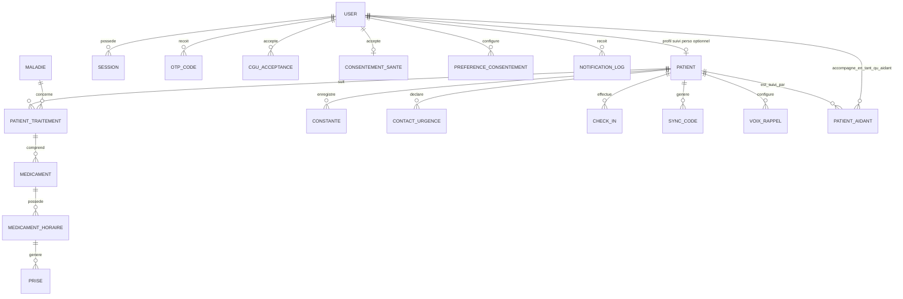

# Modèle de données formel

## Statut de ce document

Ce fichier est un **contrat**. Toute entité, tout champ, toute relation décrits ici doivent exister dans l'implémentation. Un agent qui a besoin d'un champ non listé ici doit **proposer une modification de ce fichier** plutôt que d'ajouter silencieusement un champ dans le code — ce document doit rester la source de vérité à jour, pas une photo figée du jour 1.

Les types indiqués sont **conceptuels** (ex: `UUID`, `string`, `enum`, `timestamp`), pas du SQL — la traduction en type Postgres/SQLAlchemy précis est laissée aux agents backend, en cohérence avec les conventions de `database-neon/SKILL.md`.

---

## Vue d'ensemble des relations



---

## 1. `User` — compte (identité commune)

Voir `auth-onboarding/SKILL.md`. **Pas de rôle exclusif** : un user peut cumuler profil patient + liens aidant.

| Champ | Type | Contraintes / Notes |
|---|---|---|
| id | UUID | clé primaire |
| email | string | unique, obligatoire |
| phone | string | nullable, renseigné à l'onboarding infos (optionnel) ou plus tard |
| password_hash | string | nullable si compte Google-only ; jamais en clair |
| google_sub | string | nullable, **unique** — `sub` Google |
| auth_providers | json / string[] | ex: `["email"]`, `["google"]`, `["email","google"]` |
| email_verified_at | timestamp | nullable jusqu'à OTP ; immédiat si Google |
| nom_complet | string | nullable jusqu'à l'étape onboarding `infos` |
| date_naissance | date | nullable jusqu'à `infos` |
| sexe | enum | nullable jusqu'à `infos` |
| localisation | string | nullable — ville/quartier, renseigné à `infos` |
| role | enum | **déprécié / nullable** — ne plus utiliser pour le routage ; capacités dérivées à la place. Conservé pour migration douce uniquement. V2 éventuel : `medecin`, etc. comme capacités séparées |
| onboarding_step | enum/string | `infos` → `besoin_suivi` → (`patient_traitement` → `patient_permissions`) → `termine` |
| langue | enum | dès le premier écran |
| fuseau_horaire | string | capturé à l'inscription |
| pending_email | string | nullable — email en attente OTP `change_email` |
| created_at | timestamp | |
| updated_at | timestamp | |
| deleted_at | timestamp | nullable, soft delete |

**Capacités dérivées (API, non colonnes obligatoires)** :
- `has_patient_profile` = existe une ligne `Patient` pour ce user
- `is_aidant` = au moins une `PatientAidant` active où `aidant_id` = ce user

---

## 2. `OtpCode`

| Champ | Type | Contraintes / Notes |
|---|---|---|
| id | UUID | |
| user_id | UUID (FK → User) | |
| code_hash | string | jamais le code en clair, hashé comme un mot de passe |
| type | enum | `inscription`, `reset_password`, `change_email` |
| expires_at | timestamp | courte durée (ex: 10 min) |
| used_at | timestamp | nullable, usage unique |
| tentatives | integer | compteur, pour anti brute-force |
| created_at | timestamp | |

---

## 3. `CguAcceptance`

| Champ | Type | Contraintes / Notes |
|---|---|---|
| id | UUID | |
| user_id | UUID (FK → User) | |
| version | string | ex: `v1.0`, les CGU sont versionnées |
| accepted_at | timestamp | |
| ip | string | nullable |

**Obligatoire pour tout compte** (avec ou sans profil patient / liens aidant).

---

## 4. `ConsentementSante`

| Champ | Type | Contraintes / Notes |
|---|---|---|
| id | UUID | |
| user_id | UUID (FK → User) | |
| accepted_at | timestamp | |

Distinct de `CguAcceptance` car il couvre spécifiquement le traitement des données de santé.

---

## 5. `Session` (device)

| Champ | Type | Contraintes / Notes |
|---|---|---|
| id | UUID | |
| user_id | UUID (FK → User) | |
| refresh_token_hash | string | jamais le token en clair |
| device_info | string/json | modèle, OS, identifiant appareil |
| created_at | timestamp | |
| revoked_at | timestamp | nullable |

Un utilisateur peut avoir plusieurs sessions actives (multi-appareils).

---

## 6. `Patient` — profil de suivi personnel (optionnel)

Créé quand l’utilisateur active un suivi **pour lui-même** (onboarding branche Oui, ou plus tard depuis l’accueil).  
Un user **sans** ligne `Patient` peut quand même être aidant.

| Champ | Type | Contraintes / Notes |
|---|---|---|
| user_id | UUID (FK → User, 1-1) | clé primaire = clé étrangère |
| localisation | string | peut reprendre / affiner `User.localisation` ; utile Volet 4 |
| nom_complet | string | souvent aligné sur `User.nom_complet` à la création |
| date_naissance | date | idem |
| sexe | enum | idem |
| photo_url | string | nullable — URL publique ou chemin relatif `photos/<patient_id>/<uuid>.{jpg\|png\|webp}` (upload via `PUT /patients/me/photo`) |
| notifications_accordees | boolean | |
| batterie_exemptee | boolean | |
| notifications_discretes | boolean | défaut false — ex. VIH |
| groupe_sanguin | string | nullable — enum `A`\|`B`\|`AB`\|`O` — fiche santé identité |
| rhesus | string | nullable — enum `+`\|`-` |
| electrophorese | string | nullable — enum `AA`\|`AS`\|`AC`\|`SS`\|`SC`\|`CC`\|`ne_sait_pas` |
| taille_cm | integer | nullable — 120–220 |
| groupe_sanguin_confirmed_at | timestamp | nullable — 2ᵉ validation patient |
| rhesus_confirmed_at | timestamp | nullable |
| electrophorese_confirmed_at | timestamp | nullable |
| taille_cm_confirmed_at | timestamp | nullable |
| created_at / updated_at | timestamp | |

---

## 7. `Maladie` — table de référence (catalogue)

| Champ | Type | Contraintes / Notes |
|---|---|---|
| id | UUID | |
| code | string | **unique**, slug stable (`tuberculose`, `diabete`, `hypertension`, `vih`, `autre`) — clé de recherche |
| nom | string | libellé affiché |
| description | text | nullable |
| actif | boolean | permet de désactiver une maladie sans la supprimer |
| created_at | timestamp | |
| updated_at | timestamp | |

Gérée côté backend, enrichissable sans nouvelle version de l'app mobile.  
**Ne pas** y stocker les réponses patient ni les protocoles : tables dédiées ci-dessous.

---

## 7bis. `MaladieConfig` — configuration de suivi par maladie (1-1)

| Champ | Type | Contraintes / Notes |
|---|---|---|
| maladie_id | UUID (FK → Maladie, PK) | |
| questions_onboarding | json | schéma des champs supplémentaires étape C (`code`, `type`, `label`, `options`) |
| constantes_prioritaires | json | ex. `["glycemie", "poids"]` — guide la home |
| duree_traitement_jours_typique | integer | nullable — ex. 180 pour TB |
| notifications_discretes_defaut | boolean | ex. VIH |
| created_at / updated_at | timestamp | |

---

## 7ter. `ProtocoleTraitement` — protocoles catalogue (suggestions)

| Champ | Type | Contraintes / Notes |
|---|---|---|
| id | UUID | |
| maladie_id | UUID (FK) | indexé |
| code | string | unique par maladie (`tb_standard`, `db_metformine`, …) |
| libelle | string | |
| phase_cible | enum/string | nullable — `debut`, `en_cours`, `maintenance` |
| duree_jours | integer | nullable |
| ordre | integer | affichage |
| actif | boolean | |
| created_at / updated_at | timestamp | |

Index recommandé : `(maladie_id, phase_cible, actif)`.

---

## 7quater. `ProtocoleMedicamentSuggere` — médicaments suggérés dans un protocole

| Champ | Type | Contraintes / Notes |
|---|---|---|
| id | UUID | |
| protocole_id | UUID (FK) | indexé |
| nom, dosage, forme | string | |
| prise_avec_repas | enum/string | nullable — `avant_repas`, `apres_repas`, `indifferent` |
| horaires_suggestion | json | `[{heure, jours}]` — préremplissage wizard home |
| ordre, actif | | |
| created_at / updated_at | timestamp | |

---

## Architecture en 4 couches (rappel)

```
Catalogue (lecture)     maladies → maladie_configs → protocoles → protocole_medicaments_suggeres
Contexte patient        patient_traitements (+ lien protocole_id optionnel)
Attributs maladie       patient_traitement_attributs (EAV : code + valeur JSON)
Exécution               medicaments → medicament_horaires → prises
```

---

## 8. `PatientTraitement` — contexte pathologique du patient

| Champ | Type | Contraintes / Notes |
|---|---|---|
| id | UUID | |
| patient_id | UUID (FK → Patient) | indexé |
| maladie_id | UUID (FK → Maladie) | indexé |
| protocole_id | UUID (FK → ProtocoleTraitement) | nullable — si l'utilisateur a choisi un protocole suggéré |
| phase | enum | `debut`, `en_cours`, `maintenance`, `inconnu` |
| en_traitement | boolean | |
| date_debut | date | **obligatoire** si `en_traitement=true` (règle API) |
| date_fin_prevue | date | nullable — si dépassée et `statut=actif`, le backend auto-termine (cascade meds) |
| maladie_libelle | string | nullable — si maladie = `autre` |
| lieu_suivi | string | nullable — hôpital / CMS |
| statut | enum | `actif`, `suspendu`, `termine` — indexé ; `termine` via `PATCH /patients/me/traitements/{id}` (consentement patient) |
| created_at / updated_at | timestamp | |

Un patient peut avoir plusieurs traitements actifs simultanément (plusieurs maladies).  
Les réponses spécifiques (type diabète, DOT, etc.) → `PatientTraitementAttribut`, pas ici.

---

## 8bis. `PatientTraitementAttribut` — réponses par maladie (EAV)

| Champ | Type | Contraintes / Notes |
|---|---|---|
| id | UUID | |
| patient_traitement_id | UUID (FK) | indexé |
| code | string | indexé — ex. `type_diabete`, `dot_supervise` |
| valeur | json | `{ "value": ... }` |
| created_at / updated_at | timestamp | |

Contrainte unique : `(patient_traitement_id, code)`.

---

## 9. `Medicament`

| Champ | Type | Contraintes / Notes |
|---|---|---|
| id | UUID | |
| patient_traitement_id | UUID (FK → PatientTraitement) | |
| nom | string | |
| dosage | string | |
| forme | enum | comprimé, sirop, injection, etc. |
| prise_avec_repas | enum/string | nullable |
| instructions | text | nullable |
| stock_restant | integer | nullable |
| seuil_alerte_stock | integer | nullable |
| actif | boolean | |
| created_at / updated_at | timestamp | |

---

## 10. `MedicamentHoraire`

| Champ | Type | Contraintes / Notes |
|---|---|---|
| id | UUID | |
| medicament_id | UUID (FK → Medicament) | |
| heure | time | ex: `08:00` |
| jours | string/json | jours de la semaine concernés, ou "tous les jours" |
| actif | boolean | |
| created_at / updated_at | timestamp | |

Un médicament peut avoir plusieurs horaires de prise par jour.

---

## 11. `Prise`

| Champ | Type | Contraintes / Notes |
|---|---|---|
| id | UUID | |
| medicament_horaire_id | UUID (FK → MedicamentHoraire) | |
| heure_prevue | timestamp | date + heure exacte prévue |
| statut | enum | `confirmee`, `manquee`, `en_attente` |
| confirmee_at | timestamp | nullable |
| canal | enum | `app`, `sms` — pour le fallback du Volet 4 |
| created_at | timestamp | |
| updated_at | timestamp | **Sync V2** — requis pour conflits / pull incrémental (Phase 1+ migration) |
| server_version | int | **Sync V2 (Phase 4)** — entier monotone par ligne ; incrémenté à chaque écriture serveur |

Une ligne `Prise` est générée à chaque échéance prévue par `MedicamentHoraire` (via job planifié ou génération à la volée).

**Cycle de vie `statut`** :
- `en_attente` à la création (échéances prévues, y compris futures).
- `en_attente` → `manquee` : job serveur `POST /internal/jobs/mark-prises-manquees` quand `heure_prevue + PRISE_MANQUEE_GRACE_HOURS` (défaut **12 h**) est dépassé ; **ou** cascade fin de traitement (`termine` / `date_fin_prevue` passée) sur toutes les `en_attente` restantes.
- `en_attente` | `manquee` → `confirmee` : confirmation patient (`POST /prises/{id}/confirmer`, sync-offline, sync push) — **confirmation tardive autorisée** après `manquee`.
- Jamais de downgrade `confirmee` → autre statut.

Règles de conflit sync : voir `offline-sync/SKILL.md` (pas de last-write-wins générique).

---

## 11bis. `ClientMutation` — idempotence sync (contrat futur)

> Documenté en Phase 0 ; migration Alembic = **Phase 1** (au plus tôt). Ne pas créer la table avant d’implémenter `client_mutation_id` sur les routes prises.

| Champ | Type | Contraintes / Notes |
|---|---|---|
| mutation_id | UUID | **PK** — = `client_mutation_id` envoyé par le mobile |
| user_id | UUID (FK → User) | auteur de la mutation |
| entity | string | ex. `prise`, `constante` |
| entity_id | UUID | id de l’entité cible (nullable si création client-only avant assignation) |
| op | string | ex. `confirm`, `report` |
| applied_at | timestamp | moment d’application serveur |
| result_snapshot | json | nullable — état renvoyé pour rejeu `duplicate` |

Contrainte : `mutation_id` unique globalement. Un second POST avec le même id renvoie le résultat déjà appliqué (idempotent), jamais un second effet métier.

---

## 12. `Constante`

| Champ | Type | Contraintes / Notes |
|---|---|---|
| id | UUID | |
| patient_id | UUID (FK → Patient) | |
| type | enum | `poids`, `tension`, `temperature`, `glycemie`, `humeur`, `sommeil`, extensible |
| valeur | decimal/string | selon le type (tension = deux valeurs, à structurer en JSON si besoin) |
| unite | string | |
| mesure_at | timestamp | |
| source | enum | `manuel`, `objet_connecte` |

---

## 13. `PatientAidant` — relation many-to-many

| Champ | Type | Contraintes / Notes |
|---|---|---|
| id | UUID | |
| patient_id | UUID (FK → Patient) | |
| aidant_id | UUID (FK → User) | le compte qui accompagne — pas besoin d’un « rôle » exclusif |
| statut | enum | `actif`, `revoque` |
| niveau_permission | json | ex: `{"observance": true, "constantes": false}` — **accès aux données** contrôlé avec le patient |
| notification_prefs | json | prefs **aidant** (boîte de réception) : `{"mute_prise_confirmee": false, "mute_prise_non_confirmee": false, "mute_sos": false}` — défauts `false` ; orthogonal à `niveau_permission` |
| created_at | timestamp | |
| revoked_at | timestamp | nullable |

Un patient peut avoir plusieurs aidants, un aidant peut suivre plusieurs patients.

`niveau_permission` = ce que l’aidant **peut voir**. `notification_prefs` = ce que l’aidant **accepte de recevoir** en push (mute par type, par relation). Ne pas fusionner les deux.

---

## 14. `SyncCode`

| Champ | Type | Contraintes / Notes |
|---|---|---|
| id | UUID | |
| patient_id | UUID (FK → Patient) | |
| code | string | affiché en clair côté app patient + encodé en QR |
| expires_at | timestamp | courte durée (ex: 10 min) |
| used_at | timestamp | nullable, usage unique |

---

## 15. `ContactUrgence`

| Champ | Type | Contraintes / Notes |
|---|---|---|
| id | UUID | |
| patient_id | UUID (FK → Patient) | |
| nom | string | |
| telephone | string | |
| relation | string | ex: "fils", "voisin" |

Utilisé par le bouton SOS et l'escalade du Volet 1/3.

---

## 16. `CheckIn`

| Champ | Type | Contraintes / Notes |
|---|---|---|
| id | UUID | |
| patient_id | UUID (FK → Patient) | |
| date | date | unique avec `patient_id` — un check-in par jour |
| statut | enum | `tres_mal`, `pas_top`, `ca_va`, `super`, `sans_reponse` |
| created_at | timestamp | |

Un check-in par jour et par patient.

---

## 16bis. `SosAlerte`

| Champ | Type | Contraintes / Notes |
|---|---|---|
| id | UUID | |
| patient_id | UUID (FK → Patient) | |
| statut | enum | `en_attente`, `envoye`, `annule` |
| annulable_jusqu_a | timestamp | fenêtre d’annulation (30 s par défaut) |
| envoye_at | timestamp | nullable — moment où l’alerte est considérée envoyée |
| annule_at | timestamp | nullable |
| acked_at | timestamp | nullable — aidant a acquitté |
| acked_by_aidant_id | UUID (FK → User) | nullable |
| created_at | timestamp | |
| updated_at | timestamp | |

Le geste SOS **est** le consentement (voir `engagement-principle`). Après confirm (post-fenêtre), le moteur journalise `sos_declenche` et pousse FCM aux **aidants liés** ; fallback patient = appel local 1er contact d’urgence.

---

## 16ter. `DevicePushToken`

| Champ | Type | Contraintes / Notes |
|---|---|---|
| id | UUID | |
| user_id | UUID (FK → User) | |
| token | string | FCM registration token |
| platform | string | `android` / `ios` / `web` |
| created_at / updated_at | timestamp | |

Unique `(user_id, token)`.

---

## 17. `VoixRappel`

| Champ | Type | Contraintes / Notes |
|---|---|---|
| id | UUID | |
| patient_id | UUID (FK → Patient) | **unique** — une config voix active par patient |
| type | enum | `systeme`, `personnalisee` |
| fichier_audio_url | string | nullable si `systeme` — URL API authentifiée vers le fichier |
| enregistree_par | UUID (FK → User) | nullable, l'aidant (ou le patient) qui a enregistré le message |
| created_at | timestamp | |

**Upload (personnalisée)** : formats voix uniquement — **mp3**, **m4a/aac**, **ogg/opus**. Max **2 Mo**. Vérifier magic bytes (pas seulement l’extension / Content-Type). Rejeter le reste (`FICHIER_AUDIO_INVALIDE` / `FICHIER_AUDIO_TROP_LOURD`).

---

## 18. `PreferenceConsentement` — brique du moteur Volet 7

| Champ | Type | Contraintes / Notes |
|---|---|---|
| id | UUID | |
| user_id | UUID (FK → User) | |
| type_alerte | string | ex: `contact_medecin_tension`, `alerte_checkin_absence` |
| toujours_demander | boolean | si true, jamais d'action auto, on repropose systématiquement |
| regle_auto | json | nullable, ex: `{"delai_heures": 48}` — la seule exception au consentement systématique, définie explicitement par l'utilisateur |
| created_at | timestamp | |
| updated_at | timestamp | |

---

## 19. `NotificationLog` — journal d'audit, obligatoire pour toute alerte

| Champ | Type | Contraintes / Notes |
|---|---|---|
| id | UUID | |
| destinataire_id | UUID (FK → User) | |
| type | string | |
| contenu | text | le message effectivement envoyé |
| declencheur | json | donnée/événement à l'origine de la notification |
| envoye_at | timestamp | |
| proposition | boolean | true si une réponse oui/non/reporter est attendue |
| reponse | enum | nullable : `oui`, `non`, `reporter` |
| repondu_at | timestamp | nullable |
| action_declenchee | boolean | true si une action tiers a été lancée (oui ou `regle_auto`) |
| tiers_potentiel_id | UUID (FK → User) | nullable — aidant / tiers proposé |

Aucune fonctionnalité de notification/alerte ne doit être considérée terminée si elle n'écrit pas dans `NotificationLog`.

---

## Règles transverses (à respecter par tout agent, quelle que soit l'entité codée)

1. Toute donnée métier de **suivi personnel** (traitements, prises, constantes, SOS, etc.) passe par `Patient`, pas directement par `User` — séparation compte vs profil de suivi. Un `User` sans `Patient` peut quand même être aidant via `PatientAidant`.
2. Aucune table de donnée de santé ou de notification ne doit être créée sans qu'un mécanisme de consentement (`PreferenceConsentement`) ou de journalisation (`NotificationLog`) soit prévu si elle déclenche une alerte vers un tiers.
3. Toute suppression de donnée patient doit respecter le soft delete par défaut (`deleted_at`), sauf demande explicite de suppression définitive.
4. Si un agent a besoin d'un champ ou d'une entité non listés ici, il modifie ce fichier en premier, puis code — jamais l'inverse.
5. Ne pas réintroduire un choix de rôle exclusif `patient|aidant` dans l’API ou l’UI — capacités cumulables uniquement (cf. `auth-onboarding`).
