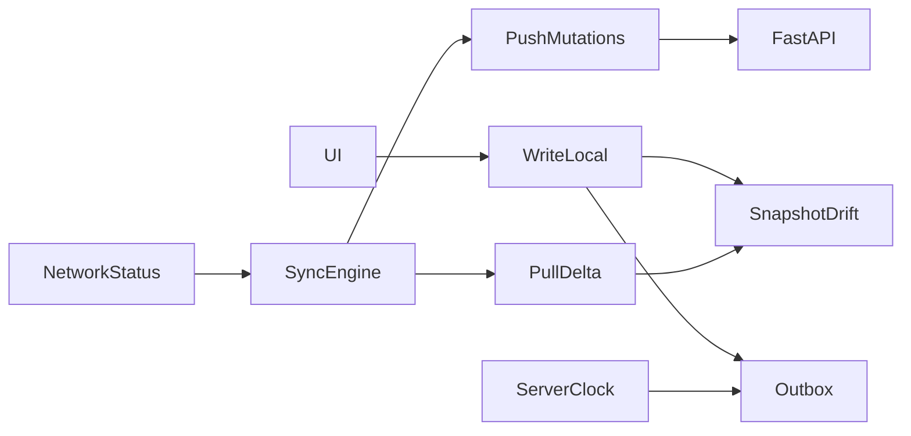

# Offline sync — SyncEngine (contrat)

Référence unique pour le sync offline-first de Fidel. **Phase 0 = contrat figé.** L’implémentation suit la roadmap en bas.

Lire aussi : `project-overview`, `mobile-flutter` (alarmes locales), `api-contract` (Sync V2), `data-model` (`Prise.updated_at`, `client_mutations`).

## Décisions figées

| Décision | Choix |
|---|---|
| Base locale | **Drift** (pas Hive / sqflite seul) |
| Projection UI | `snapshot ⊕ outbox` |
| Détection réseau | Hystérésis + probe HTTP (pas bascule seule sur `connectivity_plus`) |
| Idempotence | `client_mutation_id` (UUID) obligatoire sur toute mutation outbox |

## A. Invariants (non négociables)

1. **Idempotence** — chaque mutation porte un `client_mutation_id` unique ; rejouer N fois = un seul effet serveur (`applied` ou `duplicate`).
2. **Single-flight + FIFO par entité** — une seule passe `SyncEngine` à la fois ; pour une même `entity_id`, l’ordre d’enqueue est l’ordre d’envoi (ex. report puis confirm).
3. **Horloge serveur** — l’offset vient du header HTTP `Date` ; l’horloge device n’arbitre **jamais** les conflits. Les `client_ts` d’outbox sont corrigés via cet offset.
4. **UI = projection** — l’écran lit `snapshot ⊕ outbox`, jamais le réseau ni le snapshot brut en chemin critique (confirm / snooze / prochaines prises).

## B. Architecture

Flux type :

1. Action utilisateur → écriture locale (snapshot + enqueue outbox) dans **la même transaction Drift** quand disponible.
2. Tentative sync immédiate (best-effort) ; échec silencieux.
3. Au passage `online` (après hystérésis) : push outbox puis pull delta ; merge selon règles de conflit.
4. Acquittement serveur → retirer de l’outbox + appliquer la réponse au snapshot.

État actuel : **Phase 6 livrée** — SyncMetrics (`sync_last_pass_v1`) + checklist QA automatisée + runbook [`docs/sync-runbook.md`](../../docs/sync-runbook.md). Prefs alarme / caches `reminder_*` hors Drift. **Client Flutter V1** : flush via `SyncEngine` → `POST /sync/push` + `GET /sync/pull` uniquement — pas d’appel à `POST /prises/sync-offline` (API legacy conservée côté serveur). **§F appliqué sur `/sync/push`** (Phase B polish) : arbitrage `client_ts` vs `Prise.updated_at` pour `confirm` / `report`.

## C. Matrice d’entités

| Tier | Entités | Offline |
|---|---|---|
| **P0** | Prises (horizon 48 h + pending outbox), traitements / médicaments / horaires (miroir), prefs alarme locales, outbox `confirm` / `report` | lecture + mutation |
| **P1** | Constantes (append), historique prises 7–30 j, check-in | lecture + mutation |
| **Online-only** | Auth OTP / Google / refresh mort, activate patient, sync aidant QR, permissions aidant, upload voix, push FCM SOS aidants | réseau requis |
| **Hybrid SOS** | Countdown / confirm API online ; **appel `ACTION_CALL` local** si offline ou pas d’ack aidant (45 s) | cache 1er contact urgence |

Alarmes H0 / préavis / marquage : **toujours locales** (voir `mobile-flutter`) — hors SyncEngine réseau.

## D. Schéma outbox (contrat)

| Champ | Type | Notes |
|---|---|---|
| `mutation_id` | UUID | = `client_mutation_id` envoyé à l’API ; clé d’idempotence |
| `entity` | string | ex. `prise`, `constante` |
| `entity_id` | UUID / string | id serveur ou client temporaire |
| `op` | enum | `confirm` \| `report` \| `create_constante` \| `create_check_in` |
| `payload` | json | corps de la mutation |
| `client_ts` | timestamp | heure **corrigée** serveur |
| `attempts` | int | compteur de retries |
| `next_attempt_at` | timestamp | backoff + jitter |
| `state` | enum | `pending` \| `inflight` \| `failed_permanent` |

- Erreurs **retryables** (timeout, 5xx, réseau) → incrémenter `attempts`, replanifier.
- Erreurs **permanentes** (400 / 422 / conflit non résoluble) → `failed_permanent` (dead letter) ; **ne bloquent pas** le reste de la file.
- Backoff exponentiel plafonné (ex. 5 min) + jitter ±30 %.

## E. NetworkStatus

États : `offline` | `degraded` | `online`.

| Transition | Condition |
|---|---|
| → `online` | 2 probes consécutifs OK sur endpoint santé (ex. `/health` ou ping API) **et** stabilité ≥ **5 s** |
| `online` → `degraded` | **3** échecs consécutifs (probe ou sync) |
| `degraded` → `online` | 2 probes OK (même règle) |
| Circuit breaker | **5×** réponses 5xx → pause sync **2 min**, puis half-open (1 requête test) |

- Ne pas basculer sur le seul signal `connectivity_plus` (Wi‑Fi sans Internet fréquent au Cameroun).
- **Cooldown 30 s** minimum entre deux syncs déclenchées par la connectivité.
- Déclencheurs autorisés : retour `online` (hystérésis), `AppLifecycle.resumed` (avec cooldown), après mutation (best-effort), périodique léger app ouverte (5–10 min), pull-to-refresh manuel (ignore cooldown).

## F. Règles de conflit (remplacent LWW)

| Entité | Règle |
|---|---|
| `Prise.statut` | Intention locale gagne si `client_ts` ≥ `updated_at` serveur ; sinon serveur. Si égalité : hiérarchie `confirmee` > `manquee` > reportée / `en_attente`. Serveur `manquee` + client `confirm` → appliquer `confirmee` (**pas** conflict). Serveur déjà `confirmee` + client veut downgrade → **conflict** (comportement actuel `sync_prises_offline` conservé). |
| `Prise.heure_prevue` (report / snooze) | Dernière mutation outbox appliquée gagne ; serveur applique si version / conflit OK. |
| `Constante` | **Append-only** ; jamais d’écrasement. |
| Traitements / médicaments / horaires | **Serveur autoritaire** ; local = miroir pull. |
| Prefs alarme (Δ, snooze, son, vibration) | **Local only** — pas de sync serveur V1. |

Ne jamais inventer un merge silencieux hors de ce tableau.

## G. Roadmap d’implémentation

| Phase | Contenu |
|---|---|
| **0** | Ce contrat (skills) — **fait quand ce fichier est mergé** |
| **1** | `SyncEngine` + outbox SharedPreferences ; `client_mutation_id` sur confirm / report / sync-offline — **implémentée** |
| **2** | `ServerClock` + `NetworkStatus` (hystérésis, probe, circuit breaker) — **implémentée** |
| **3** | Drift : snapshot P0 + projection UI Accueil / confirm-snooze — **implémentée** |
| **4** | `POST /sync/push` + `GET /sync/pull?since=` (voir `api-contract`) — **implémentée** |
| **5** | P1 : constantes, historique prises, check-in — **implémentée** |
| **6** | Observabilité, tests rejeu / flapping / horloge fausse, runbook — **implémentée** |

## Checklist QA (référence Phase 6)

- [x] Rejeu : même `mutation_id` ×3 → un seul effet serveur (`duplicate` ensuite)
- [x] Coupure après envoi avant réponse → retry sans doublon
- [x] Réseau on/off toutes les 2 s pendant 1 min → ≤ 2 passes de sync (cooldown + hystérésis)
- [x] Horloge device −3 h → ordre des mutations et conflits restent corrects
- [x] Serveur `confirmee` + client veut `en_attente` → conflict, pas downgrade

Voir aussi `docs/sync-runbook.md`.
